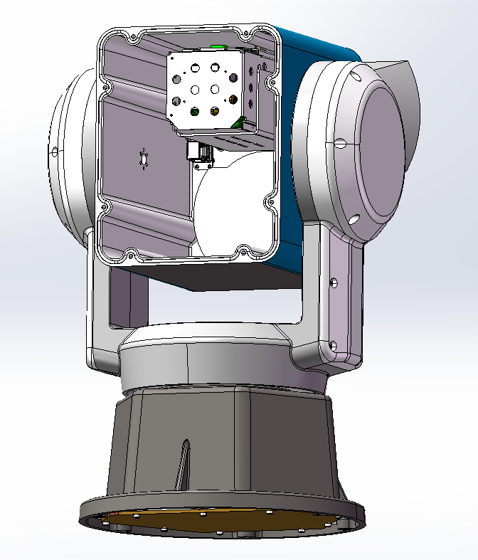
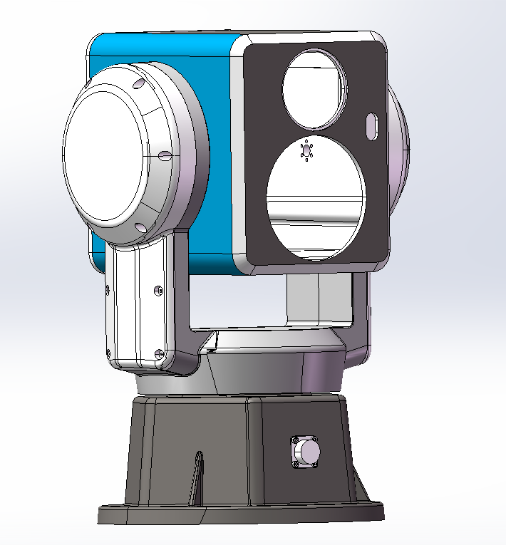
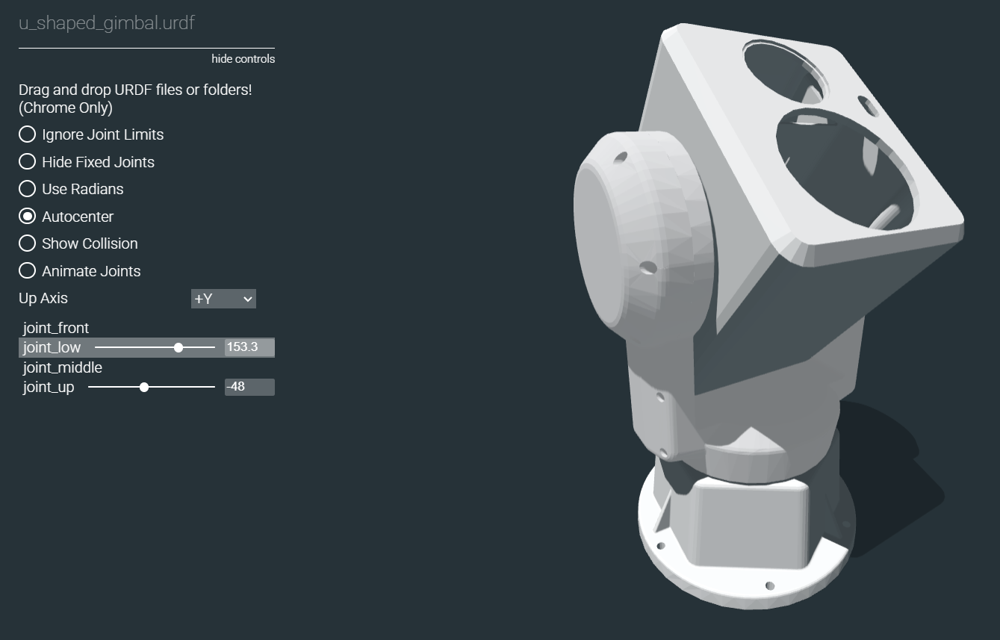
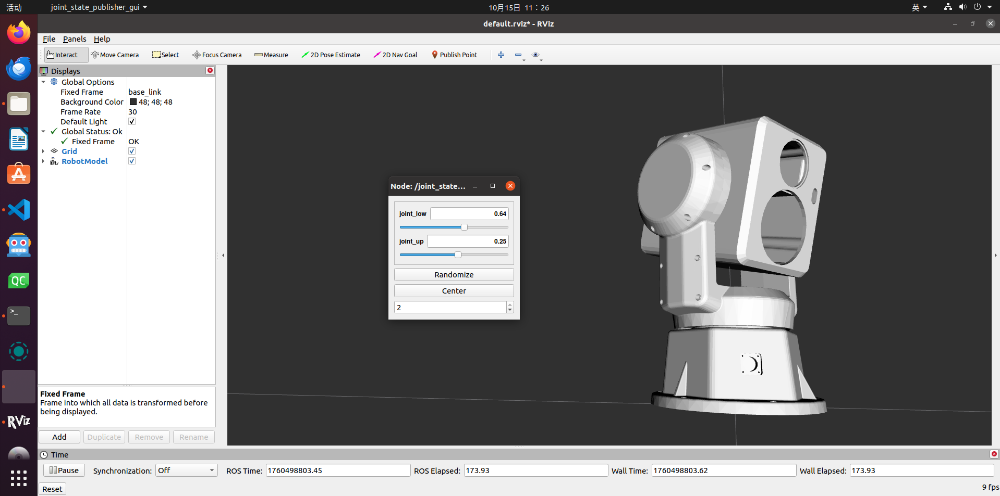
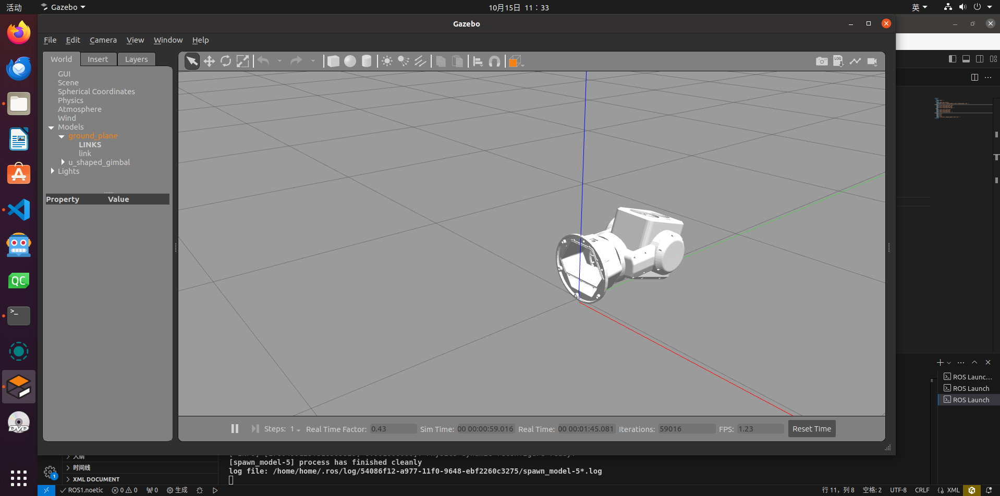
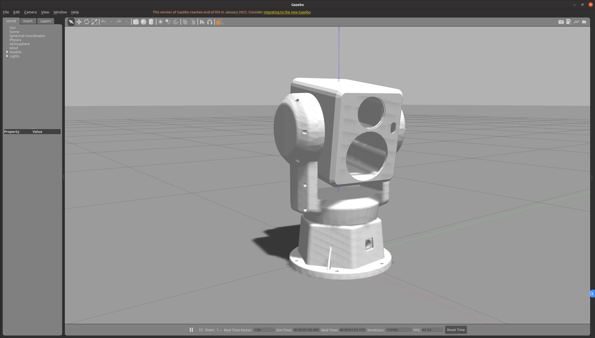
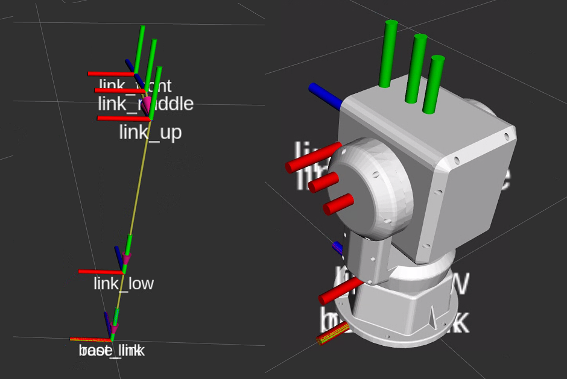
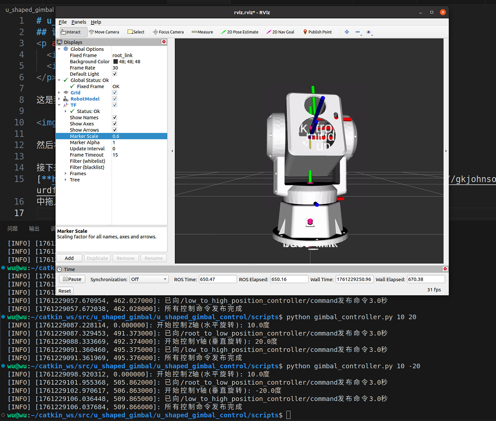

# U型云台模型的水平转动和俯仰转动仿真
## 说明
<p align="center">
  
  
</p>

这是我从原始云台中，去除了相机、玻璃片后的模型。



然后将其通过 `sw2urdf` 转换成 URDF 文件，方便大家后续能够使用。

接下来你就可以在  
[**https://gkjohnson.github.io/urdf-loaders/javascript/example/bundle/**](https://gkjohnson.github.io/urdf-loaders/javascript/example/bundle/)  
中拖入这一整个文件夹进行查看，并可以拉动左下角的拉杆进行观察。



## ROS 运行

- 在rviz中可视化
```shell
roslaunch u_shaped_gimbal_description display.launch
```


- 在gazebo中仿真

```shell
roslaunch u_shaped_gimbal_description gazebo.launch
```



目前由于没有进行坐标系的转换，所以模型是倒地的。

通过设置
```xml
  <!-- 虚拟根节点 -->
  <link name="root_link"/>
  <!-- root_link 到 base_link 的固定关节 -->
  <joint name="root_to_base" type="fixed">
    <parent link="root_link"/>
    <child link="base_link"/>
    <!-- 绕 X 轴 +90°，再绕 Z 轴 +90°，帮助云台立起来 -->
    <origin xyz="0 0 0" rpy="1.5708 0 1.5708"/>
  </joint>
```
可以使得云台立起来。



这是关节的父子关系。



## 仿真控制云台进行水平和俯仰运动

光有模型而没有控制，那这个云台就只是一个摆设，他也就动不起来。

控制云台动，需要在gazebo中实现，当gazebo中进行水平和俯仰运动后，在rviz中也能够看到云台的运动后的结果。

控制云台进行水平和俯仰运动的配置以及代码，我都放在了`u_shaped_gimbal_control`中，从而符合模块之间的分离。

通过运行以下命令，可以实现云台的水平旋转10度，俯仰旋转20度的效果。
```shell
python u_shaped_gimbal_control/scripts/gimbal_controller.py 10 20
```
**在这里面，按照rpy正负的定义，朝左和朝下是正，朝右和朝上是负。**



## 最后
如果需要原始模型，可以通过网盘下载

链接：[**https://pan.quark.cn/s/35a948faf0dc**](https://pan.quark.cn/s/35a948faf0dc)

里面包含原始模型，绑定点、轴、坐标系，使用sw2urdf的设置模型过程的模型，方便大家自己动手。